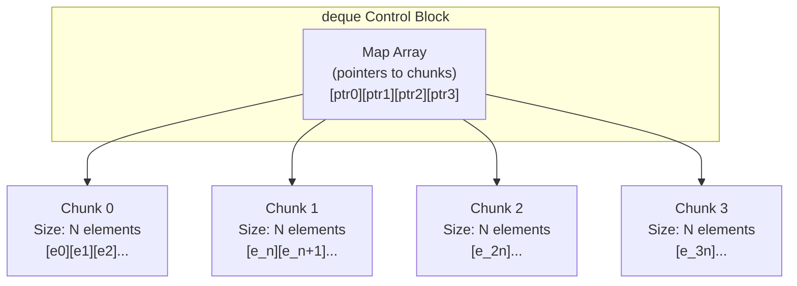

# Deque Design Document

## Overview

A `deque` is a data structure that 

## Standard Library

#### Memory Layout Visualization

```mermaid
graph TB
    subgraph "deque Control Block"
        MAP["Map Array<br/>(pointers to chunks)<br/>[ptr0][ptr1][ptr2][ptr3]"]
    end
    
    MAP --> CHUNK0["Chunk 0<br/>Size: N elements<br/>[e0][e1][e2]..."]
    MAP --> CHUNK1["Chunk 1<br/>Size: N elements<br/>[e_n][e_n+1]..."]
    MAP --> CHUNK2["Chunk 2<br/>Size: N elements<br/>[e_2n]..."]
    MAP --> CHUNK3["Chunk 3<br/>Size: N elements<br/>[e_3n]..."]
```
